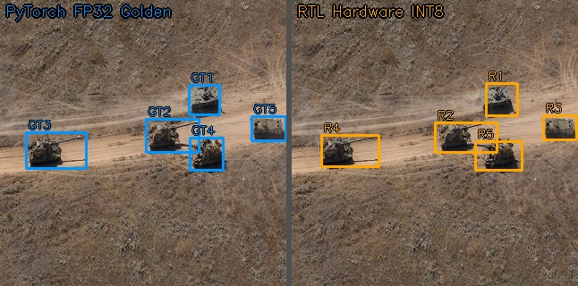

# 🚀 YOLO-Tank

**A Resource-Efficient FPGA Accelerator for YOLOv8 Detection Head with On-Chip DFL Decoding and Division-Free NMS**

---

## 📸 Demo — Verilator Simulation Detection Result

<p align="center">
  
</p>

<p align="center"><i>Detection results from RTL simulation via Verilator (KIIT-MiTA dataset, 320×320 input)</i></p>

---

## 🏗️ Architecture Overview

```text
       ARM Cortex-A9 (PS)                             Programmable Logic (PL)
┌──────────────────────────────┐          ┌──────────────────────────────────────────────────┐
│                              │          │          Global Finite State Machine             │
│        DDR Memory            │          │             (Sequential 6-Stage)                 │
│                              │          │                                                  │
│   ┌──────────────────────┐   │          │  ┌─────────┐   ┌─────────┐   ┌─────────┐         │
│   │ YOLOv8 Backbone +    │   │ AXI4     │  │  RAM A  │   │  RAM B  │   │  RAM C  │         │
│   │ Neck Feature Maps    │ ──┼──────────┼─►│ (Input) │◄─►│ (Multi) │◄─►│ (cv2)   │         │
│   └──────────────────────┘   │ Burst    │  └────┬────┘   └────┬────┘   └────┬────┘         │
│                              │          │       │             │             │              │
│                              │          │  ┌────▼─────────────▼─────────────▼────┐         │
│                              │          │  │       Resource-Multiplexed CNN      │         │
│                              │          │  │ 16x MAC Array (6 DSPs) + Q-Pipeline │         │
│                              │          │  └──────────────────┬──────────────────┘         │
│                              │          │                     │                            │
│                              │          │  ┌──────────────────▼──────────────────┐         │
│                              │          │  │       Zero-DSP DFL Accelerator      │         │
│                              │          │  │         256-entry BRAM LUT          │         │
│                              │          │  └──────────────────┬──────────────────┘         │
│                              │          │                     │                            │
│   ┌──────────────────────┐   │          │  ┌──────────────────▼──────────────────┐         │
│   │ Valid Detections     │◄──┼──────────┼──│         Division-Free NMS           │         │
│   └──────────────────────┘   │ AXI4     │  │         Cross-Multiply (4 DSPs)     │         │
└──────────────────────────────┘          └──────────────────────────────────────────────────┘
```

---

## ✨ Key Innovations

| Innovation | Description |
|:-----------|:------------|
| **Resource-Multiplexed CNN** | Single configurable MAC engine reused across all 6 head layers via time-division multiplexing with ping-pong buffering. |
| **Zero-DSP DFL Decoder** | 256-entry BRAM LUT replaces floating-point Softmax, eliminating exponential math and extracting coordinates with 0 DSPs. |
| **Division-Free IoU NMS** | Cross-multiplication `inter × D > union × N` eliminates hardware dividers, filtering spatial candidates with only 4 DSPs. |
| **Quantization Pipeline** | Activation scaling factors fused directly into hardware, achieving INT8 inference without runtime floating-point overhead. |

---

## 📊 Implementation Results — Zynq-7020 (xc7z020clg400-1)

| Metric | Value |
|:-------|:------|
| Throughput | **32.1 FPS** @ 105 MHz |
| Power Efficiency | **106.3 FPS/W** |
| Post-Processing Latency | **1.84 ms** |
| LUT Usage | 24,115 / 53,200 (45.3%) |
| FF Usage | 11,048 / 106,400 (10.4%) |
| BRAM Usage | 125 / 140 (89.3%) |
| DSP48 Usage | **10** / 220 (4.55%) |
| PL Dynamic Power | 0.302 W |
| mAP₅₀ (INT8, KIIT-MiTA) | 67.0% |
| WNS (Timing) | +0.074 ns |

---

## 📁 Repository Structure

```text
YOLO_Tank/
│
├── README.md
│
├── source/                          # RTL source — Detection Head
│   ├── detect_head_seq.v            #   Sequential 6-layer global controller
│   ├── conv_stage.v                 #   Configurable convolution stage
│   ├── cnn_engine_dynamic.v         #   16-PE MAC array engine
│   ├── line_buffer.v                #   BRAM-based 3×3 sliding window
│   ├── dfl_accelerator.v            #   5-stage DFL pipeline + LUT Softmax
│   ├── seq_divider.v                #   Sequential restoring divider
│   ├── iou_nms_unit.v               #   Division-free IoU NMS unit
│   ├── yolov8_top_core.v            #   Top-level detection head core
│   ├── yolov8_axi_wrapper_full.v    #   AXI4 bus wrapper
│   ├── ooc_timing.xdc               #   Out-of-context timing constraints
│   └── yolov8_system.xdc            #   Full system constraints
│
├── IAAA head/                       # Manuscript
│   └── manuscript.pdf               #   Final Submission Manuscript (PDF only)
│
├── testbench/                       # Verilator & Verilog testbenches
│   └── tb_cycle_measure.cpp         #   Cycle-accurate timing measurement
│
├── weights_and_mem/                 # INT8 quantized weights & LUT data
│   ├── exp_lut_p3.mem               #   DFL exponential lookup table
│   └── tank_centers.mem             #   NMS detection output
│
├── training model/                  # 5-Phase Model Training Pipeline
│   ├── run_tank_pipeline.bat        #   Automated training batch script
│   └── tank_pcq_finetune.py         #   Per-Channel Quantization core
│
├── python_utils/                    # Python verification & visualization
│   └── check_rtl_vs_python_accuracy.py  # RTL vs golden comparison
│
├── scripts/                         # Simulation shell scripts
│   └── run_all_verilator.sh         #   Run all Verilator simulations
│
└── demo/                            # Demo images & detection results
```

---

## 🔧 Quick Start

### Prerequisites

- **Verilator** ≥ 4.0 (RTL simulation)
- **Python 3.8+** with `numpy`, `torch`, `ultralytics`
- **Vivado 2024.2** (synthesis & implementation)

### Train the Model (Optional)

The full 5-phase training pipeline (SiLU 640 → ReLU KD 320 → PCQ-FT → INT8 `.mem` Extraction) is entirely automated via a Windows batch script:

```bat
cd "training model"
run_tank_pipeline.bat
```

### Run Verilator Simulation

```bash
# 1. Regenerate weight .mem files from trained model
cd python_utils
python3 regenerate_all.py

# 2. Run detection head simulation
cd ../scripts
bash run_all_verilator.sh

# 3. Visualize NMS results
cd ../python_utils
python3 visualize_hardware_nms.py
```

### Vivado Synthesis

```bash
# Source files are in source/
# Constraints: yolov8_system.xdc (full) or ooc_timing.xdc (OOC)
# Top module: yolov8_top_core
```

---

## 📚 Dataset

Trained and evaluated on the [KIIT-MiTA Military Vehicle Dataset](https://doi.org/10.1109/ISACC65211.2025.10969335)
— 2,139 images, single class (military vehicle), 320×320 resolution.

---

## 📝 Citation

```bibtex
@inproceedings{nguyen2026yolotank,
  title   = {YOLO-Tank: A Resource-Efficient FPGA Accelerator for YOLOv8
             Detection Head with On-Chip DFL Decoding and Division-Free NMS},
  author  = {Vo, Hoang Nguyen and Tran, Vo Hai Dang and Vo, Tuan Binh},
  booktitle = {Proc. Int. Conf. Intelligent Autonomous Agents and Applications (IAAA)},
  year    = {2026}
}
```

---

## 📄 License

This project is released for **academic research purposes only**.
